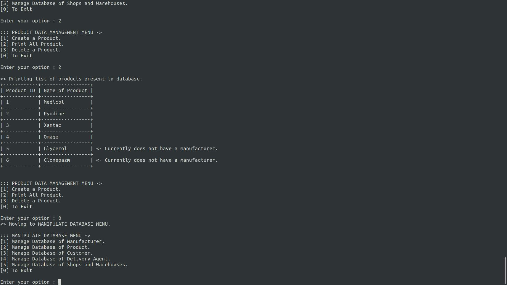

# Interactive-CLI-MedShop

*In a program-automated-online medicine shop, these are the following set of relevant entities:*
- *Manufacturer*
- *Customer*
- *Product*
- *Shops and Warehouses*
- *Delivery agent.*

<strong>Intutitively I wanted to make a SQL catered for an Online Medicine Shop!</strong>

All entities have a unique id (int), and a name (String). Additionally, a manufacturer has a set of products which it can manufacture. Each product has a manufacturer who can manufacture it. Customers have a zip code (int) and a list of purchased products, which are initially empty. Shops and Warehouses have a zip-code (int), an inventory of the number of available copies of all
products. A delivery agent has a zip-code (int), and the number of products delivered. 

### This project involves designing and implementing a back-end java program following the object oriented paradigm, and implementing the following functionalities:
> 1. Create, delete and print entities of each type. For delete first all entities of a type are printed and
then a option is provided to choose one
> 2. Add a product to manufacturer
> 3. Add a certain number of copies of a product to a shop
> 4. Add an order of a product from a customer
> 5. Process an order (can be satisfied only if the product is available at a shop in the customer’s zipcode). Also a delivery agent is assigned who has delivered the least number of products.
> 6. List all the purchases made by a customer
> 7. List inventory of a shop (Products and counts) 
> 8. Products made by a manufacturer
> 9. A master text-based interface to access all the above functionalities

## A sample view during regular use of the CLI interface

  

